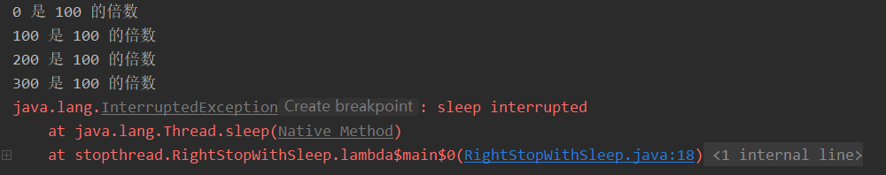

### 如何正确停止线程
#### 原理
原理介绍 ： 使用 **interrupt** 来通知 ， 而不是强制

在什么情况下停止 ？
> run 方法运行完毕，异常出现但未捕获
```java
    public static void main(String[] args) throws InterruptedException {
        RightStopThread rightStopThread = new RightStopThread();
        Thread thread = new Thread(rightStopThread);
        thread.start();
        Thread.sleep(1000);
        thread.interrupt();

        }

@Override
public void run() {
        int num = 0;
        while (!Thread.currentThread().isInterrupted() && num <= Integer.MAX_VALUE / 2) {
        if (num % (int)1e4 == 0)
        System.out.println(num + "是1w的倍数");
        num ++;
        }
        System.out.println("线程运行任务结束了");

        }
```
线程可能被阻塞
```java
  public static void main(String[] args) throws InterruptedException {
        Runnable runnable = () -> {
            int num = 0;
            try {
            while (num <= 300 && !Thread.currentThread().isInterrupted() ) {
                if (num++ % 100 == 0)
                    System.out.println(num - 1 + " 是 100 的倍数");
            }
                Thread.sleep(1000);
            } catch (InterruptedException e) {
                e.printStackTrace();
            }
        };
        Thread thread = new Thread(runnable);
        thread.start();
//        让子线程执行 到睡 1000 ms
        Thread.sleep(500);
        thread.interrupt();
    }
```
                                              

线程在每次迭代后都阻塞
```java
package stopthread;

/**
 * 不能中断
 * 如果在 while 里面放 try/catch ，会导致中断失效
 *
 * @author zm
 * @date 2023/02/27
 */
public class CantInterrupt {
    public static void main(String[] args) throws InterruptedException {
        Runnable runnable = ()  -> {
            int num = 0;
            while (num <= 10000 && !Thread.currentThread().isInterrupted()) {
                if (num % 100 == 0)
                    System.out.println(num + "是100 倍数");
                num ++;
                try {
                    Thread.sleep(10);
                } catch (InterruptedException e) {
                    e.printStackTrace();
                }
            }
        };
        Thread thread = new Thread(runnable);
        thread.start();
        thread.sleep(5000);
        thread.interrupt();
    }
}

```


#### 面试题
如何停止线程

如何处理不可中断的阻塞（抢锁时 ReentrantLock.lock() 或者 Socket I/O 无法响应中断）