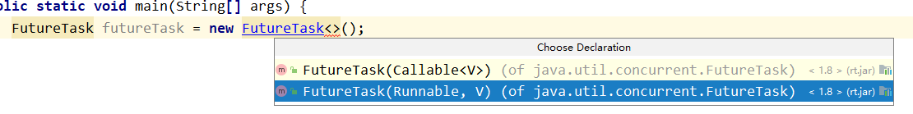
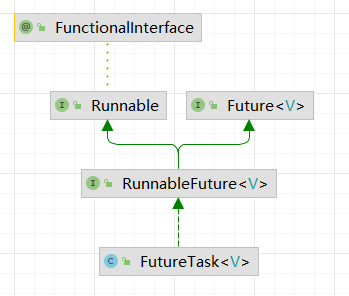

### 并发编程核心概念
单核 执行多个任务 即为 `并发`。

同一时间在不同计算机、处理器、或者处理器核心上同时运行多个项目  ``并行``。

###### 同步
* 控制同步 : 一个任务 开始依赖于另一个任务的结束时，第二个任务不能再第一个任务完成时开始
* 数据访问同步：当两个或者多个任务访问共享变量时、任意时间 只有一个任务可以访问这个变量。
* 临界段的概念 ：一段代码，可以访问共享资源，是处理时不可分割的代码区域。由`互斥`实现。进入临界段 关闭中断 、 离开临界段 ，要立即打开中断。
```java
public synchronized void set() {
    // 临界段
}
```
* 常用的同步机制
  * 信号量（semaphore）
  * 监视器 ： 共享资源上实现互斥的机制。有 互斥、条件变量 、两种操作（等待条件和通报条件）。一旦通报了条件，等待他的任务中只有一个会继续执行。
###### 不可变对象
  不能修改 线程安全的。

###### 原子操作 原子变量
###### 共享内存 消息传递（通信）


### JMM 内存模型 与 happens-before
###### 内存可见性问题

#### 启动
**多线程的启动 底层调用 start0（本地） 方法  juc + jvm 不分家**

```java
public synchronized void start() {
        if (threadStatus != 0)
            throw new IllegalThreadStateException();
        group.add(this);
        boolean started = false;
        try {
            start0();
            started = true;
        } finally {
            try {
                if (!started) {
                    group.threadStartFailed(this);
                }
            } catch (Throwable ignore) {
            }
        }
    }
    private native void start0();
```

### COMPLETABLE FUTURE
`FUTURETASK 复习`

```java
public class FutureTest {
    public static void main(String[] args) throws ExecutionException, InterruptedException {
        FutureTask<Integer> integerFutureTask = new FutureTask<>(() -> {
//            子线程去执行 耗时任务
            System.out.println(Thread.currentThread().getName() + "\t" + "-----come in");
            TimeUnit.SECONDS.sleep(2);
            return 1024;
        });

        new Thread(integerFutureTask,"t1").start();

        System.out.println("--------------- 主线程继续干它该干事情");

        System.out.println(integerFutureTask.get());
    }
}
```

##### FutureTask 接口架构

##### FutureTask 缺点
* **阻塞**  get方法导致主线程同步等待（不管是否计算完成）。`futureTask.get()` 推荐放在最后。 使用 get(2,TimeUint.SECONDS) 过时不候。

```get(2,TimeUint.SECONDS)``` 甩锅方法 子线程写的不行~~
**轮询解决 futureTask.get() 的阻塞  -> 但是主线程还在阻塞  CPU 打满了**
```java
   while (true) {
            if (integerFutureTask.isDone()) {
                System.out.println("-------result " + integerFutureTask.get());
                break;
            }else System.out.println("还在计算中");
        }
```
##### future 改进~ 多线程异步任务编排
```java
public class CompletableFuture<T> implements Future<T>, CompletionStage<T>  // 继承了两个接口功能
```
**CompletionStage  代表异步计算过程中的某一个阶段、一个阶段完成后可能触发另一个阶段  step by step**

#### 什么是高并发
* 克服阻塞、尽量少加锁不要加锁、什么可以替代阻塞。
* 高并发、不要忘记`CAS` , 用轮询替代阻塞