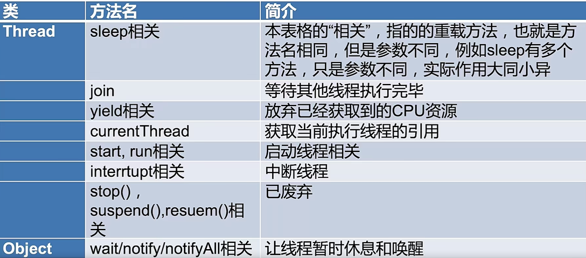

###  为什么  wait 和 notify 方法 放在 obj 里 ，sleep 方法放在 thread里

###  三种方法实现 生产者消费者模型

###  join 和 sleep 和 wait 间线程状态是什么 为什么


### 方法概览



###### wait notify notifyAll
* 作用 和 用法 ：阻塞阶段、 唤醒阶段、遇到中断
  * 阻塞阶段
    * wait() 方法
  * 唤醒阶段 
    * notify 、 notifyAll 方法。
  * 遇到中断
    * 抛出 ```被打断异常``` 释放 `minotor锁`
